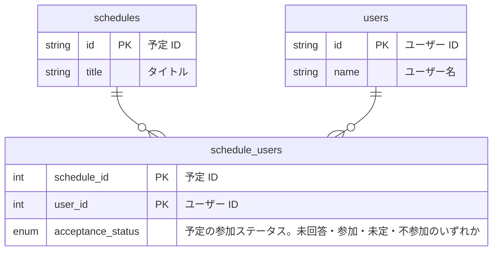

こんにちは！アルダグラムでエンジニアをしている渡邊です！

弊社の KANNA アプリで先日カレンダー機能をリリースしました🎉
KANNA はノンデスクワーカー向けのプロジェクト管理アプリとなっており、カレンダーによってユーザーの「案件」と「予定」がカレンダー上に可視化されるようになります。

簡単に言ってしまうと Google カレンダーのようなものになっています。

|  |  |
| ------- | ------- |

カレンダー機能を実装するにあたって工夫した点などの Tips を紹介していきたいと思います！

# オフライン対応

ユーザーの利便性を考慮して、カレンダーの予定の情報はオフラインでも見れるように対応しました。 この辺は [Google のドキュメント](https://developer.android.com/topic/architecture/data-layer/offline-first?hl=ja) を参考にしています。

どの画面でも予定を表示する時は、**端末内（ローカル）のデータベースの情報を必ず参照する**ようにしています。
データベースを扱うライブラリには [Room](https://developer.android.com/training/data-storage/room?hl=ja) を使っており、[Dao の戻り値を Flow にする](https://developer.android.com/training/data-storage/room/async-queries?hl=ja#observable)ことでデータベースに変更があった際には更新された値が都度通知されるようになるので、その値を画面に表示し直すことで自動的に表示が変わるように実装しています。

例えば予定の詳細を表示する画面では、以下のメソッドを使ってデータベースから予定の情報を取得しています。

```kotlin:ScheduleDao.kt
@Transaction
@Query("SELECT * FROM schedules WHERE schedules.id = :scheduleId")
fun getScheduleWithUserAndAcceptanceStatuses(scheduleId: ScheduleId): Flow<ScheduleWithUserAndAcceptanceStatuses?>
```

また予定の情報自体は API サーバーから取得する必要があるので、予定の情報の取得に関してはざっくりと以下のような処理になっています。

1. ログイン後: API サーバーから対象ユーザーの予定の情報を全て取得する
2. 一度予定を取得した後 : 前回予定を取得してから、**更新があった予定の情報のみ**を取得する

取得した情報はローカルのデータベースに保存しています。
ログイン後は一度に予定の情報を取得するため少し時間はかかってしまうかもしれませんが、一度予定の情報を取得した後は更新があった予定のみを取得するようになります。
これによって、例えばカレンダーのページを表示するたびに情報を取得する実装と比較して、無駄な通信を省くことができているかと思います。

# Room の中間テーブルに ID 以外のフィールドがある場合の1対多のデータ取得方法

予定詳細画面と呼ばれる画面では、予定とその予定に参加するユーザーの一覧が表示されるようになっています。

|  |
| --- |


カレンダーでは「予定」に「ユーザー」を登録することができるため、データベースのテーブルには以下があります。

- schedules （予定テーブル）
- users （ユーザーテーブル）
- schedule_users （予定とユーザーの中間テーブル）

ER 図は以下のようになっています。（一部省略しています）



この時予定とユーザーは1対多の関係になっているので、[Room のドキュメント](https://developer.android.com/training/data-storage/room/relationships?hl=ja#one-to-many) を参照すると `@Relation` アノテーションを使って以下のような感じで予定とユーザー一覧が取得できます。

```kotlin:ScheduleWithUsers.kt
data class ScheduleWithUsers(
    @Embedded val schedule: Schedule,
    @Relation(
        parentColumn = "id",
        entityColumn = "schedule_id"
    )
    val users: List<User>
)
```

```kotlin:ScheduleDao.kt
@Transaction
@Query("SELECT * FROM schedules WHERE schedule.id = :scheduleId")
fun getScheduleWithUsers(scheduleId: ScheduleId): Flow<ScheduleWithUsers?>
```

しかし予定詳細画面ではユーザーの参加ステータスも表示する必要があるのですが、参加ステータスは予定とユーザーの中間テーブルにあるため、この方法だと参加ステータスを取得することができません。

そこでユーザーの情報、予定 ID、参加ステータスを取得する[ビューを作成](https://developer.android.com/training/data-storage/room/creating-views?hl=ja)して、そのビューを使って情報を取得するようにしました。

ますは以下のようにビューを作成します。

```kotlin:UserAndAcceptanceStatus.kt
@DatabaseView(
    viewName = "user_and_acceptance_status",
    value = """
    SELECT users.*, schedule_users.schedule_id, schedule_users.acceptance_status
    FROM users 
    INNER JOIN schedule_users ON users.id = schedule_users.user_id
    """
)
data class UserAndAcceptanceStatus(
    @Embedded val user: User,
    @ColumnInfo("schedule_id") val scheduleId: ScheduleId,
    @ColumnInfo("acceptance_status") val acceptanceStatus: AcceptanceStatus
)
```

このビューを使って予定とその予定に参加するユーザーの一覧を取得します。

```kotlin:ScheduleWithUserAndAcceptanceStatuses.kt
data class ScheduleWithUserAndAcceptanceStatuses(
    @Embedded val schedule: Schedule,
    @Relation(
        parentColumn = "id",
        entityColumn = "schedule_id"
    )
    val userAndAcceptanceStatuses: List<UserAndAcceptanceStatus>
)
```

```kotlin:ScheduleDao.kt
@Transaction
@Query("SELECT * FROM schedules WHERE schedules.id = :scheduleId")
fun getScheduleWithUserAndAcceptanceStatuses(scheduleId: ScheduleId): Flow<ScheduleWithUserAndAcceptanceStatuses?>
```

これによってユーザーの参加ステータスも含んだ状態で予定を取得することができます。

# カレンダーの週表示のスクロール位置の同期

カレンダーで週表示している場合、時間の表示位置を各ページで同期するようにしています。（以下のキャプチャ参照）

|  |
| --- |

これは Google カレンダーでも同じような動作になっているので参考にしてみました。

どうやっているかというと、左側の時間を表示している Composable の ScrollState と各週ごとのページの Composable の ScrollState のインスタンスを共通のものを使用しています。
そうすることでスクロール位置が同期できるようになっています。

# カレンダーのタップ領域をタップしやすいように調整

カレンダーの各日にちや時間の空いている領域をタップすると、予定を作成する画面へ遷移するようになっています。
また、予定をタップすると予定の詳細が表示される画面へと遷移するようになっています。

元々は以下の緑の枠のように領域全体をタップできるようにしていましたが、予定をタップする際に間違って予定作成画面が表示されてしまうことが多く、あまりよいユーザー体験ではないと感じました。

|  |
| --- |

そこで以下の赤枠のように、予定の部分を避けてタップ領域を設定するように対応しました。
この対応によって間違ってタップしてしまうことがなくなり、よいユーザー体験になったかと思います。

|  |
| --- |


# ロジックのテスト

カレンダーの予定を表示するためには色々と複雑な処理を実装する必要がありました。
例えば以下はある日の予定の数が多くてカレンダー内に表示が収まりきらなかった場合に、その日の予定をボトムシートで表示した場合の画面です。

|  |
| --- |

この予定の並び順の仕様が複雑で、予定が終日かどうか、予定の期間の長さなど様々な条件によって並び順が決まります。
このようなロジックに対してはテストを書くことで、ロジックが正しいかどうかを検証しました。
以下はコードの一部抜粋で、テストには [kotest](https://kotest.io/) というフレームワークを使っています。

```kotlin:BottomSheetSchedulesConverter.kt
/**
 * ボトムシートの予定の表示のための並び替えと変換処理を行う.
 */
object BottomSheetSchedulesConverter {
    operator fun invoke(
        targetDate: LocalDate,
        scheduleRepresentations: List<UserScheduleRepresentation>
    ): BottomSheetSchedules {
        // 並び替えのロジックが書かれている.
    }
}
```

```kotlin:BottomSheetSchedulesConverterTest.kt
class BottomSheetSchedulesConverterTest : WordSpec({
    "BottomSheetSchedulesConverter" should {
        "BottomSheetSchedules を返し、allDaySchedules が終日の予定で期間が長い順 -> 終日でなく複数日にちにまたがっている予定で期間が長い順にソートされていること" {
            val schedules = BottomSheetSchedulesConverter(LocalDate.of(2023, 3, 13), scheduleRepresentations)
            schedules.allDaySchedules.map { it.id } shouldContainInOrder listOf(
                ScheduleId("2"),
                ScheduleId("3"),
                ScheduleId("1"),
                ScheduleId("6"),
                ScheduleId("7"),
                ScheduleId("5"),
                ScheduleId("4")
            )
        }
    }
    
    ...
```

# 最後に

以上、カレンダー対応で行なった一部について紹介させていただきました。
カレンダー機能を実装してみて、カレンダーって特に表示部分の実装が意外と難しいんだなと思いましたが、何とかリリースができてよかったです！
まだ引き続き機能追加を行なっているので、ユーザーにより良いものが提供できるようにしていけたらと思っています！
