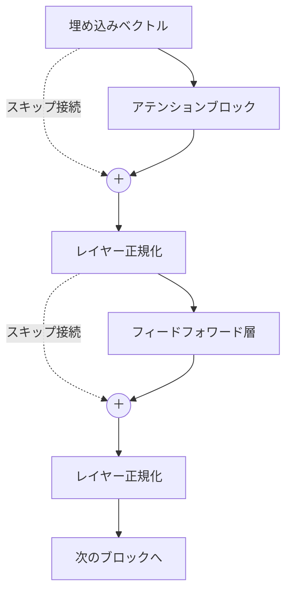

こんにちは！
[株式会社 Aldagram](https://aldagram.com/about/) でエンジニアとして働いている渡邊です！

先日弊社メンバーから [【輪読会レポート】Attention ってなに？](https://zenn.dev/aldagram_tech/articles/what_is_attention) というブログ記事が公開されましたが、この輪読会に私も参加して、大規模言語モデル（LLM）の仕組みについて学んでいます。

今回の記事では数式を使わずに Transformer の概要を紹介します！ ちなみに輪読会で読んでいる本ではもちろん数式が出てきます。

:::message
**LLM 輪読会とは**

社内で開催されている輪読会の一つで、 LLM の原理を理解することを目標としています！
週に 1 回、5 人前後で議論しながら取り組んでいます。

- 読んでいる本： [作ってわかる大規模言語モデルの仕組み](https://bookplus.nikkei.com/atcl/catalog/26/03/09/02514/)
:::

# Transformer とは？

**Transformer** とはニューラルネットワークのアーキテクチャです。 2017年に Google が「Attension Is All You Need」という論文で初めて紹介しました。 ChatGPT などの LLM のベースとなっている技術です。 Transformer は当初、機械翻訳のために設計されました。

# Transformer の構成

Transformer は「**エンコーダ**」と「**デコーダ**」という2つの要素から構成されます。 例えば英語から日本語に翻訳する場合、エンコーダが英語の文章を解析して理解 → デコーダはエンコーダから得た情報を元に日本語の文章を生成する、という流れになります。

近年では　GPT のような「デコーダ」のみのモデルが急速に発展しており、このようなモデルでは文章を渡すとその文章の次に続く単語の確率分布を計算し、文章を生成していきます。

エンコーダとデコーダは、内部では共通の構造を持つ「ブロック」を何層も積み重ねて作られています。

このブロックの中身を見ていきましょう。

# Transformer ブロックの構成

1つのブロックの中身を図にすると、次のようになります。

この図に登場する5つの部品が、Transformer の中核です。

以下、それぞれが何をしているかを、数式を使わずに説明します。

## 埋め込みベクトル変換

コンピュータは、そのままでは「猫」や「犬」といった単語を扱えません。

そこで最初に、単語を**埋め込みベクトル**と呼ばれる数値の列に変換します。

埋め込みベクトルの中では、意味が近い単語ほど近い位置に配置されます（「犬」と「猫」は近く、「犬」と「机」は遠い、といった具合です）。

ただし、埋め込みベクトルだけでは、文中での単語の並び順は表現できません。

例えば、「金子さんは猫を飼っている」という文章は、並び順の情報がなければ「猫は金子さんを飼っている」と区別がつかなくなってしまいます。

そこで実際には、単語の位置を表す情報（**位置エンコーディング**）を埋め込みベクトルに加算し、「何番目に出てきた単語か」も一緒に表現します。

## アテンションブロック

**アテンションブロック**は、文中の各単語が、他のどの単語に注目すべきかを計算する部品です。

例えば「のび太はどこでもドアをカバンに入れて持ち帰ろうとしたが、**それ**は大きすぎて入らなかった」という文で「**それ**」が何を指すかを理解するには、文中の他の単語との関係を見る必要があります（「大きすぎて入らない」のは入れる側の「どこでもドア」であって、入れ物である「カバン」ではない）。

アテンションブロックは、この「どの単語とどの単語が関係しているか」を、単語ごとに重み付けして計算します。

アテンションの仕組みそのものは、弊社メンバーが書いた [【輪読会レポート】Attention ってなに？](https://zenn.dev/aldagram_tech/articles/what_is_attention) で紹介されています。

## レイヤー正規化

**レイヤー正規化**は、各層を通過した後の数値のばらつきを整える部品です。

ニューラルネットワークは層を重ねるほど、値が極端に大きくなったり小さくなったりして、学習が不安定になりやすくなります。

レイヤー正規化は、層の出力を一定の範囲に整えることで、この不安定さを抑え、学習を安定させる役割を持ちます。

## フィードフォワード層

**フィードフォワード層**は、アテンションブロックが計算した結果を、単語ごとに個別に変換する部品です。

アテンションブロックが「単語同士の関係」を扱うのに対し、フィードフォワード層は「それぞれの単語の情報を、より豊かな表現に変換する」役割を持ちます。

イメージとしては、アテンションブロックが集めてきた情報を、フィードフォワード層が整理し直す、という関係です。

## スキップ接続

**スキップ接続**は、ある層への入力を、その層の出力にそのまま足し合わせる仕組みです（図の「＋」の部分にあたります）。

層を深く重ねるほど、入力の情報が処理の過程で失われたり、学習がうまく進まなくなったりします。

スキップ接続を挟むことで、元の入力の情報を後段にそのまま伝えられるようになり、層を深く重ねても学習が崩れにくくなります。

図のとおり、スキップ接続はアテンションブロックの前後と、フィードフォワード層の前後の2箇所に配置されています。

ここで紹介した5つの部品を1つのブロックとして、これを何層も重ねたものが、エンコーダでありデコーダです。

# 最後に

今回は Transformer を構成する5つの部品を、数式を使わずに紹介しました。

ちなみに弊社には書籍購入制度があり、私はこの制度を利用して[AIがわかる数学入門](https://www.oreilly.co.jp/books/9784814401666/)を購入したので、こちらの本と併せてさらに理解を深めようと思っています！

もっとアルダグラムエンジニア組織を知りたい人は、ぜひ下記の情報をチェックしてみてください！
